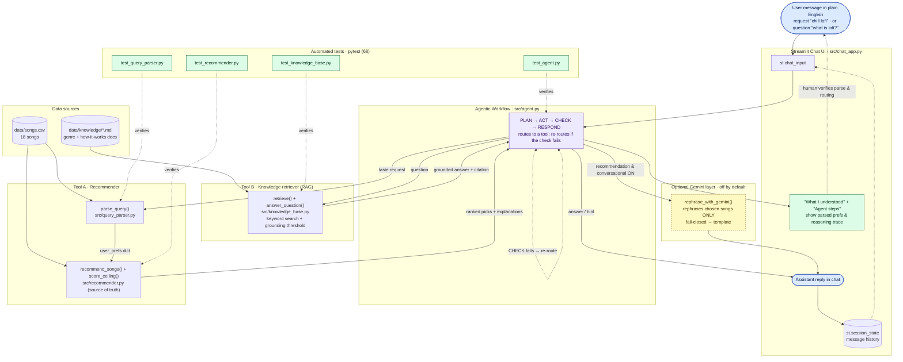

# 🎵 Music Recommender Simulation

## Project Summary

In this project you will build and explain a small music recommender system.

Your goal is to:

- Represent songs and a user "taste profile" as data
- Design a scoring rule that turns that data into recommendations
- Evaluate what your system gets right and wrong
- Reflect on how this mirrors real world AI recommenders

**My version (MoodMatch 1.0)** is a small, transparent, content-based music
recommender you run from the command line. You describe your taste — a genre, a
mood, a target energy, and whether you like acoustic sound — and it scores every
song in an 18-song catalog, then returns the best matches with a plain-language
reason for each pick. It leans hard into being *honest and explainable*: it maps
unfamiliar words (like "sad" or "k-pop") onto known ones, it says out loud when
it cannot honor a request, and it shows a simple 0–10 score so results are easy
to compare. See [`model_card.md`](model_card.md) for the full write-up.

### Original project (Modules 1–3) → this milestone (Module 4)

**Original project — MoodMatch 1.0 (Modules 1–3).** A small, transparent,
content-based music recommender run from the command line. Its goal was to turn a
user's stated taste (favorite genre, mood, target energy, acoustic preference) into
ranked song recommendations from an 18-song catalog, and — its defining capability — to
explain *every* pick in plain language, including honest caveats when a request could
not be met and synonym mapping for unfamiliar terms.

**This milestone (Module 4).** Building on the RAG lesson from the course notebook, I
wrapped that engine in a **natural-language chat interface** (Streamlit). Instead of
hand-editing preference dicts, a user now types a sentence; a query parser turns it into
the same structured preferences the original scorer already consumes. The original
`recommender.py` is unchanged and remains the source of truth — the new layers only
*translate* free text in and *phrase* results out.

---

## Architecture

Source: [`diagrams/architecture.mmd`](diagrams/architecture.mmd) (Mermaid). A rendered
PNG can be exported to [`assets/architecture.png`](assets/) — see
[`assets/README.md`](assets/README.md) for the one-line command.



**Data flow (input → process → output).** A message enters the Streamlit chat and goes to
the **agent** (`src/agent.py`), which plans a route and calls one of two tools:
**Tool A (Recommender)** — `parse_query()` turns taste requests into a structured
`user_prefs` dict, and `recommender.py` ranks every song with a plain-language
explanation; or **Tool B (Knowledge retriever)** — `knowledge_base.py` retrieves a
grounded answer from the fact documents for *questions*. The agent **checks** each tool's
result and re-routes if its first guess was wrong, then the reply is shown in chat. The
**optional Gemini layer** only rephrases already-chosen songs (never selects them) and
fails closed, so it cannot hallucinate recommendations.

**Where humans & testing check the AI results** (green nodes). The _"What I understood"_
and _"Agent steps"_ panels surface the parsed preferences **and** the routing decision on
every turn — the human-in-the-loop checkpoint. Four `pytest` suites verify each component
independently (parser, scorer, retriever, agent router), and `src/main.py` additionally
stress-tests the scorer against deliberately adversarial profiles.

---

## How The System Works

Real-world platforms like Spotify and YouTube predict what you'll love next by blending two ideas: **collaborative filtering** (learning from the behavior of millions of listeners — what people with similar taste play, like, skip, and group into playlists) and **content-based filtering** (matching the actual attributes of songs, such as genre, tempo, mood, and acoustic qualities). They fuse these into large hybrid models that also factor in context like time of day and recent activity. My version is a small, transparent **content-based** recommender: with no crowd data available, it prioritizes matching a single user's stated taste to the measurable attributes of each song, and — just as importantly — it prioritizes being *explainable*, so every recommendation comes with a plain-language reason for why it was chosen. It favors clarity over sophistication: a simple weighted score that a person can read and understand, rather than a black box.

### Features used in the simulation

Each **`Song`** stores these attributes (from `data/songs.csv`):

- `id`, `title`, `artist` — identity/display only
- `genre` — e.g. pop, lofi, rock (primary matching signal)
- `mood` — e.g. happy, chill, intense
- `energy` — 0.0–1.0 intensity
- `tempo_bpm` — beats per minute
- `valence` — 0.0–1.0 musical positivity
- `danceability` — 0.0–1.0
- `acousticness` — 0.0–1.0 (acoustic vs. produced/electronic)

Each **`UserProfile`** stores the taste preferences the score is built from:

- `favorite_genre` — the genre the user most wants to hear
- `favorite_mood` — the feeling/context they're after
- `target_energy` — the energy level they're aiming for (0.0–1.0)
- `likes_acoustic` — whether they prefer an acoustic or a produced sound

### How a score is computed

The `Recommender` applies a **weighted scoring rule** to each song. Every song's score is the sum of four terms, with genre weighted most heavily:

| Feature | Weight | How it scores |
|---|---|---|
| genre | **3.0** | exact match → full points; otherwise **partial credit** by similarity (see below) |
| mood | **2.0** | exact match → full points; otherwise **partial credit** by similarity |
| energy | 2.0 | `2 × (1 − |song.energy − target_energy|)` — closer is better |
| acousticness | 1.0 | rewards high values if `likes_acoustic`, low values otherwise |

**Partial credit for genre & mood (additive similarity).** An exact genre or mood match still earns the full weight, so exact matches always win. When a song's genre/mood *doesn't* match, instead of scoring zero it earns a fraction of the weight based on how similar it *sounds* to the user's favorite. That similarity is **objective and data-derived**, not hand-tuned:

- For the favorite genre (and, separately, the favorite mood), the system computes a **centroid** — the average feature vector of every song in the catalog carrying that label.
- A candidate song's closeness is `1 − mean(|difference|)` between its features and that centroid, giving a value in 0–1.
- The similarity is only measured over `tempo_bpm`, `valence`, and `danceability` — the three features **not** already scored elsewhere, so nothing is double-counted. `tempo_bpm` is scaled to 0–1 using the catalog's own min/max; the other two are already on a 0–1 scale.
- The closeness is **squared** before use, so strong matches stay strong while mediocre ones are pushed down. This keeps exact matches clearly ahead and prevents the ranking from flattening.

Each contributing term also records a short reason (e.g. *"matches your favorite genre (lofi)"* or *"has a similar audio profile (tempo, valence, danceability) to lofi"*), and those reasons become the explanation shown with the recommendation.

### Refinements beyond the starter logic

On top of the core score above, the recommender adds five behaviors that make it
more robust and more honest:

- **Out-of-vocabulary handling.** If you type a genre or mood the catalog does
  not know, a synonym table maps it onto an existing label so it still scores
  against a real centroid (e.g. `sad` → `melancholic`, `k-pop` → `pop`,
  `euphoric` → `uplifting`). Truly unknown words (like `polka`) stay unmatched.
- **Honest disclosure.** When a stated preference cannot be met (e.g. an
  acoustic lover asking for loud EDM), the explanation appends a *"note:"*
  instead of silently dropping the wish.
- **Truthful fallback wording.** A non-exact genre match is described as a
  *"similar audio profile"*, not a genre match — because that is what was
  actually measured.
- **Normalized score.** Alongside the raw score, output shows a `/10` score that
  divides by only the terms that *could* score, so a song matched purely on
  audio features does not look broken next to a fully-specified request.
  Ranking still uses the raw score; the `/10` is display only.
- **Genre-aware phrasing.** The word for a non-acoustic sound fits the genre:
  "amplified, heavy sound" for rock/metal, "produced/electronic sound" for
  EDM/pop, "clean, produced sound" otherwise.

### Finalized Algorithm Recipe

```
For each song, score = genre_term + mood_term + energy_term + acoustic_term

  genre_term    = 3.0                          if song.genre == favorite_genre
                = 3.0 × similarity(song, favorite_genre_centroid)²   otherwise
  mood_term     = 2.0                          if song.mood == favorite_mood
                = 2.0 × similarity(song, favorite_mood_centroid)²    otherwise
  energy_term   = 2.0 × (1 − |song.energy − target_energy|)
  acoustic_term = 1.0 × (song.acousticness if likes_acoustic else 1 − song.acousticness)

  where similarity(song, centroid) = 1 − mean(|Δtempo_norm|, |Δvalence|, |Δdanceability|)
        and tempo is min/max-scaled to 0–1 across the catalog.
```

### How songs are chosen

A separate **ranking rule** scores *every* song with the recipe above, sorts them from highest to lowest, and returns the top `k`. Splitting scoring (judging one song) from ranking (comparing and selecting the whole list) keeps the scoring logic simple and reusable, and makes it easy to change weights or selection behavior independently.

```
recommend_songs (ranking)
   ├── build data-derived centroids once from the catalog
   ├── score_song(user, song)  ← run once per song
   ├── sort by score, high → low
   └── return top k
```

### Potential biases I expect

This system makes deliberate choices, and each one introduces a bias worth naming:

- **Genre is weighted highest (3.0).** The system may over-prioritize genre and bury great songs that nail the user's *mood* but sit in a different genre. A perfect chill track in an "unexpected" genre can lose to a mediocre in-genre one.
- **Popularity/representation bias in the centroids.** A genre or mood with only one or two songs in the catalog has a shaky, noisy centroid (a 1-song genre's centroid *is* that song). Well-represented genres get more stable, more trustworthy similarity scores — so the recommender is implicitly fairer to whatever is already common in the catalog.
- **Filter bubble / over-specialization.** Because it optimizes for "more of what you already like," it rarely broadens taste. Highly relevant surprises from adjacent styles are always ranked below the exact-match block.
- **The similarity features are weak genre discriminators.** By excluding energy and acousticness (to avoid double-counting), similarity rests on tempo, valence, and danceability — which don't always separate very different genres well, so an occasional odd "similar audio profile" pairing can slip through.
- **Only measurable attributes count.** The system has no understanding of lyrics, language, culture, or *why* a person loves a song — so it can systematically under-serve tastes that don't reduce to these numeric features.

---

## Getting Started

### Setup

1. Create a virtual environment (optional but recommended):

   ```bash
   python -m venv .venv
   source .venv/bin/activate      # Mac or Linux
   .venv\Scripts\activate         # Windows

2. Install dependencies

```bash
pip install -r requirements.txt
```

3. Run the app:

```bash
python -m src.main
```

### Chat interface

A conversational front-end lets you type a request in plain English instead of
editing preference dicts:

```bash
streamlit run src/chat_app.py
```

Try requests like `chill lofi for studying`, `high-energy rock, not acoustic`, or
`something happy and upbeat` — or ask a **question** like `what is lofi?` or
`how are recommendations scored?`. An agent (`src/agent.py`) routes each message to
the recommender or the knowledge retriever; "What I understood" and "Agent steps"
panels show exactly what was detected and how it was routed. This runs fully offline —
no API key required. (See [Stretch Features](#stretch-features) for the agent + RAG
details.)

**Optional conversational replies (Gemini).** Mirroring the class RAG notebook,
the app can rephrase its picks into a chattier reply. This is off by default and
never chooses songs (so it can't hallucinate recommendations). To enable it:

```bash
pip install google-genai
export GEMINI_API_KEY=...        # your key
streamlit run src/chat_app.py    # then flip "Conversational replies" in the sidebar
```

You can preview a parse without launching the UI:

```bash
python src/query_parser.py "chill lofi for studying, acoustic"
```

### Running Tests

Run the starter tests with:

```bash
pytest
```

You can add more tests in `tests/test_recommender.py` (scorer) and
`tests/test_query_parser.py` (natural-language parsing).

---

## Sample Recommendation Output

`python -m src.main` runs three "normal" profiles and several adversarial
edge-case profiles, printing the top 5 for each with a raw score and a
normalized `/10` score. Here is the first profile as an example:

```
Loaded songs: 18

########## NORMAL PROFILES ##########

============================================================
Profile: High-Energy Pop
Preferences: {'genre': 'pop', 'mood': 'happy', 'energy': 0.9, 'likes_acoustic': False}
------------------------------------------------------------
1. Sunrise City by Neon Echo [pop/happy] - Score: 7.66 (9.6/10)
   Because: matches your favorite genre (pop), fits the happy mood you like, energy level is close to what you want, has the produced/electronic sound you prefer
2. Gym Hero by Max Pulse [pop/intense] - Score: 7.59 (9.5/10)
   Because: matches your favorite genre (pop), has a feel similar to the happy mood, energy level is close to what you want, has the produced/electronic sound you prefer
3. Rooftop Lights by Indigo Parade [indie pop/happy] - Score: 7.31 (9.1/10)
   Because: has a similar audio profile (tempo, valence, danceability) to pop, fits the happy mood you like, energy level is close to what you want, has the produced/electronic sound you prefer
4. Concrete Sunrise by Verse Vandal [hip hop/energetic] - Score: 6.68 (8.3/10)
   Because: has a similar audio profile (tempo, valence, danceability) to pop, has a feel similar to the happy mood, energy level is close to what you want, has the produced/electronic sound you prefer
5. Basement Pulse by Nullwave [EDM/dark] - Score: 6.40 (8.0/10)
   Because: has a similar audio profile (tempo, valence, danceability) to pop, has a feel similar to the happy mood, energy level is close to what you want, has the produced/electronic sound you prefer
```

The full output for every profile — including the adversarial ones that probe
conflicting, impossible, and unknown requests — is documented in the Evaluation
section of [`model_card.md`](model_card.md).

---

## Sample Interactions (chat)

Real, unedited outputs from the offline chat (`streamlit run src/chat_app.py`, top 3
shown). The `parsed` line is exactly what the "What I understood" panel displays.

**1. A clear, fully-specified request**

```
You: chill lofi for studying, acoustic
parsed: {'genre': 'lofi', 'mood': 'chill', 'energy': 0.3, 'likes_acoustic': True}
Bot:
  1. Library Rain — Paper Lanterns [lofi/chill] (9.7/10)
     matches your favorite genre (lofi), fits the chill mood you like, energy level is close to what you want, has the acoustic sound you prefer
  2. Midnight Coding — LoRoom [lofi/chill] (9.3/10)
     matches your favorite genre (lofi), fits the chill mood you like, energy level is close to what you want, has the acoustic sound you prefer
  3. Focus Flow — LoRoom [lofi/focused] (9.2/10)
     matches your favorite genre (lofi), has a feel similar to the chill mood, energy level is close to what you want, has the acoustic sound you prefer
```

**2. An out-of-vocabulary genre, remapped honestly**

```
You: something happy and upbeat, k-pop
parsed: {'genre': 'k-pop', 'mood': 'happy', 'energy': 0.9}
Bot:
  1. Sunrise City — Neon Echo [pop/happy] (9.6/10)
     matches your favorite genre (pop (interpreted from "k-pop")), fits the happy mood you like, energy level is close to what you want, has the produced/electronic sound you prefer
  2. Gym Hero — Max Pulse [pop/intense] (9.5/10)
     matches your favorite genre (pop (interpreted from "k-pop")), has a feel similar to the happy mood, energy level is close to what you want, has the produced/electronic sound you prefer
  3. Rooftop Lights — Indigo Parade [indie pop/happy] (9.1/10)
     has a similar audio profile (tempo, valence, danceability) to pop (interpreted from "k-pop"), fits the happy mood you like, ...
```

**3. A contradictory request (high energy + "sad") — the system stays honest**

```
You: high energy but sad
parsed: {'mood': 'sad', 'energy': 0.9}
Bot:
  1. Iron Verdict — Ashfall [metal/aggressive] (7.0/10)
     energy level is close to what you want, has the amplified, heavy sound you prefer
  2. Basement Pulse — Nullwave [EDM/dark] (7.0/10)
     energy level is close to what you want, has the produced/electronic sound you prefer
  3. Storm Runner — Voltline [rock/intense] (6.7/10)
     energy level is close to what you want, has the amplified, heavy sound you prefer
```

Energy dominates here because the catalog has no high-energy "sad" songs — `sad` maps to
`melancholic`, whose songs are all low-energy, so it contributes little. The reasons make
that trade-off visible rather than hiding it.

**4. An unrecognizable request — graceful fallback (no bad recommendations)**

```
You: polka chaotic gibberish
parsed: {}
Bot: I couldn't pick up a genre, mood, or vibe from that. Try "chill lofi for
     studying", "high-energy rock, not acoustic", or "something happy and upbeat"...
```

---

## Design Decisions

- **Keep the original scorer untouched; add layers around it.** The new chat is a thin
  translation shell: free text → `parse_query` → the *existing* `user_prefs` dict →
  `recommend_songs`. This preserved every tested guarantee of MoodMatch 1.0 and kept the
  new surface small and independently testable. *Trade-off:* the chat can only express
  what the scorer already understands (one genre, one mood, energy, acoustic) — it can't,
  say, honor "80s synthwave *or* modern EDM."
- **A deterministic keyword parser instead of an LLM for understanding.** Parsing reuses
  the recommender's own `GENRE_SYNONYMS`/`MOOD_SYNONYMS`, so it needs no API key, runs
  offline, is instant, and is fully unit-testable. *Trade-off:* it misses phrasings
  outside the vocabulary and cue tables (a real LLM would generalize better) — accepted
  in exchange for zero cost, determinism, and testability.
- **The LLM (Gemini) only *phrases*, never *chooses*.** When enabled, it rephrases the
  already-selected songs and is grounded strictly in them, with a fail-closed fallback to
  the template. This directly applies the notebook's lesson — retrieval/ranking stays
  deterministic so the LLM can't hallucinate a song that isn't in the catalog. *Trade-off:*
  the conversational reply is a cosmetic layer, not smarter recommendations.
- **Whole-word matching via alnum look-arounds, not substrings.** So `popcorn` never
  matches `pop` and `metallica` never matches `metal`, while `k-pop`, `r&b`, and `lo-fi`
  still match. Multi-word labels are matched longest-first so `indie pop` beats `pop`.
- **Empty parse → a helpful hint, not a recommendation.** An unrecognizable query returns
  `{}`; the app refuses to rank on it (which would meaninglessly sort by low acousticness)
  and instead nudges the user with examples.
- **Show the parse every turn.** The "What I understood" panel makes the one place the
  system can misread the user *visible*, turning a silent failure mode into an obvious one.

---

## Stretch Features

Two optional features extend the required chat, both fully offline. Full reasoning traces
and a before/after are in [`ai_interactions.md`](ai_interactions.md); raw traces in
[`logs/agent_traces.md`](logs/agent_traces.md) (regenerate: `python scripts/generate_traces.py`).

### Agentic Workflow (multi-step reasoning + tool-calls)

Each message runs through an explicit chain in [`src/agent.py`](src/agent.py):
**PLAN** (question vs. request, pre-parse taste) → **ACT** (call the recommender *or* the
knowledge retriever) → **CHECK** (did it work?) → **RESPOND**. If the CHECK fails — a
"question" that grounds nothing, or a "request" with no parseable taste — the agent
**re-routes** to the other tool. The "Agent steps" panel shows the trace live. Example
re-route:

```
User: can you play something euphoric?
1. [PLAN] question-like=True; parsed taste={'mood': 'euphoric'} → try the knowledge tool first
2. [ACT] called knowledge retriever → grounded=False, score=0.00, top_source=None
3. [CHECK] not grounded, but taste terms were parsed → RE-ROUTE to recommend
4. [ACT] called recommender → 5 picks
5. [RESPOND] returned recommendations
```

### RAG Enhancement (retrieval over a second data source)

Beyond the song catalog, the system now retrieves from a second source — fact documents in
[`data/knowledge/`](data/knowledge/) — via a keyword retriever in
[`src/knowledge_base.py`](src/knowledge_base.py), with citations and a grounding threshold
that yields an honest "I don't have that" instead of a guess. **Before/after** for the
message *"what is lofi?"*:

| | Behavior |
|---|---|
| **Before** (recommender only) | Parses "lofi" as a genre and returns a *list of lofi songs* — never answers the question. |
| **After** (agent → retriever) | Routes to the retriever and returns a grounded definition from `genres.md`: *"Lofi (short for 'low-fidelity') is relaxed, downtempo music built around mellow beats…"* (`grounded=True, score=1.00`). |

---

## Testing Summary

**Automated tests — all passing.** `68 tests pass (31 scorer + 23 parser + 8 knowledge +
6 agent)` via `pytest`, running in ~0.1s with no network or API key.

- `tests/test_recommender.py` (31) — scoring/ranking, synonym resolution, honest caveats,
  normalized ceiling, and the audio-similarity fallback.
- `tests/test_query_parser.py` (23) — genre/mood detection (multi-word, hyphenated,
  synonym), substring safety (`popcorn`≠`pop`), energy cues, acoustic negation, the
  detected-keys-only contract, and one integration test asserting a parsed sentence flows
  through the real scorer to the expected top pick.
- `tests/test_knowledge_base.py` (8) — document chunking, heading-weighted retrieval, the
  grounding threshold (an unrelated question is *not* grounded), and the honest fallback.
- `tests/test_agent.py` (6) — each routing path plus the reflection/re-route step, and
  that a reasoning trace is always produced.

**What worked.** Clear, in-vocabulary requests parse and rank exactly as intended (see
Sample Interactions 1–2), and out-of-vocabulary terms resolve honestly with an
"interpreted from" note. Unrecognizable input degrades gracefully instead of returning
junk.

**What didn't / what I learned.** Contradictory requests ("high energy but sad") expose a
real limit: because the catalog has no high-energy melancholic songs, energy dominates and
the "sad" intent barely registers — the parser did its job, but the small catalog can't
satisfy the request. I also learned the parser is only as good as its cue tables: a mood
phrased with a word not in `MOOD_SYNONYMS` is simply missed. Making the parse visible in
the UI was the single highest-value reliability decision — most "wrong" answers trace back
to a misread request, and now that is one glance away.

**Human evaluation.** I manually reviewed the chat on representative inputs:

| Test input | Evaluation criteria | Result |
|---|---|---|
| `chill lofi for studying, acoustic` | Parses all 4 fields; top picks are lofi/chill/acoustic | **Pass** |
| `high-energy rock, not acoustic` | Detects negated acoustic; rock ranked first | **Pass** |
| `something happy and upbeat, k-pop` | `k-pop`→pop with visible "interpreted from" note | **Pass** |
| `high energy but sad` | Honest handling of an unsatisfiable combo | **Partial** — ranks by energy; "sad" under-served (catalog gap, surfaced not hidden) |
| `I ate popcorn` | No false genre match from a substring | **Pass** |
| `polka chaotic gibberish` | Empty parse → helpful hint, no recommendation | **Pass** |

---

## Reflection

Building the chat layer made concrete how much of a "smart" recommender is really
*translation*: the hard, interesting problem was mapping messy human phrasing onto a
handful of structured features, and everything downstream was the same transparent math
from Modules 1–3. Keeping the LLM on phrasing-only duty — never letting it pick songs —
was the clearest lesson from the RAG notebook: grounding the model in a fixed, retrieved
set is what separates a helpful assistant from a confident fabricator. It also reframed
"testing an AI" for me — the most useful reliability work wasn't a clever metric but
making the system's one interpretation step *visible*, so a human can catch a misread
before it becomes a bad recommendation.

My graded responsible-AI reflection — how I collaborated with AI, one helpful and one
flawed AI suggestion, and the system's limitations — is in
[**`model_card.md`**](model_card.md).


